## RestTemplte
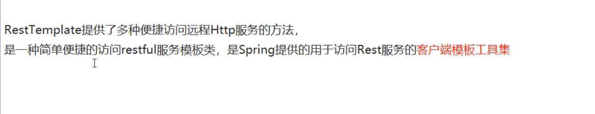

## SpringCloud微服务
 第一个项目 目前有消费者(调用生产者的业务) 和 生产者(提供业务接口实现类)
 并且两个公用一个实体类(Domain) 所以和Dubbo很像
 - 生产者 消费者 接口工厂(存放实体类 Dao Service接口)

## SpringCloud微服务流程
 1 创建三个文件
   消费者 继承接口工厂
   生产者 继承接口工厂
   接口工厂
 2 实现接口工厂中的接口 
 3 实现消费者的api
 4 创建消费者
 5 在消费者中创建一个Config创建RestTemplate对象在Spring容器中
6  通过RestTemplate对象 请求生产者的api 并且获取结果
 
  与 Dubbo非常像

## 以上为基础部分

## 以下为初级部分

## Eureka 基础(服务注册与发现) 已停止更新
 就是一个服务注册 可以管理于服务之间的关系（a服务 调用 b服务）
通过Eureka 可以实现 服务调用 负载均很 容错 实现服务发现与注册

# 什么是服务注册
每一个微服务 通过注册的方式 将自己的信息放在注册服务器上 消费者可以直接调用上面的注册的方法 
 也就类似于 Dubbo+ZooKeeper 
  Dubbo
  先注册生产者到spring.dubbo.registry:zookeeper://localhost:2181
  然后通过  spring.dubbo.server = true 来声明为当前的applicaton.name 为生产者
  在实现类 中 通过 @Service(InterFace=...) 来暴露要提供给消费者的对象

  消费者 直接监听spring.dubbo.registry:zookeeper://localhost:2181
  然后通过@Refrence注解获取对应的对象
  
 Dubbo 成员
      
           注册中心          接口工厂
    消费者           生产者

 
## Eureka 的组件
  Eureka Server 提供服务注册服务 
    每一个微服务节点 通过配置启动后 会在EurekaServer中进行注册 这样 EurekaServer 中的服务注册表中将会存储所有可用的服务节点的信息
 服务节点 的信息 可以在信息界面中直观的看到

  EurekaClient 通过注册中心进行访问
是一个java的客户端  简化Server的操作
  应用启动后 将会向Server发送心跳(默认为30s)

# Eureka 注册中心的搭建
# 1写配置
[- 端口]
server.port=7001
[- eureka名称]
eureka.instance.hostname=localhost
[- 该项代表当前的类就是服务注册中心]
eureka.client.register-with-eureka=false
[- 该项代表当前的类就是服务注册中心 所以不用检索服务]
eureka.client.fetch-registry=false 
[- 该地址相当于 Dubbo服务注册要使用的地址]
eureka.client.service-url.defaultZone=http://${eureka.instance.hostname}:${server.port}/eureka
  
# 2 写注解
@SpringBootApplication
[@EnableEurekaServer]
public class EurekaApplication {

    public static void main(String[] args) {
        SpringApplication.run(EurekaApplication.class, args);
    }

}

## 添加生产者到注册中心
添加依赖
  <dependency>
            <groupId>org.springframework.cloud</groupId>
            <artifactId>spring-cloud-starter-netflix-eureka-client</artifactId>
        </dependency>

[@EnableEurekaClient] 注解 标识当前的类是一个服务消费/提供者

配置
# Eureka
# 是否注册进Eureka
eureka.client.register-with-eureka=true
# 是否订阅
eureka.client.fetch-registry=true
# 注册的端口
eureka.client.service-url.defaultZone=http://localhost:7001/eureka

## 注册成功后
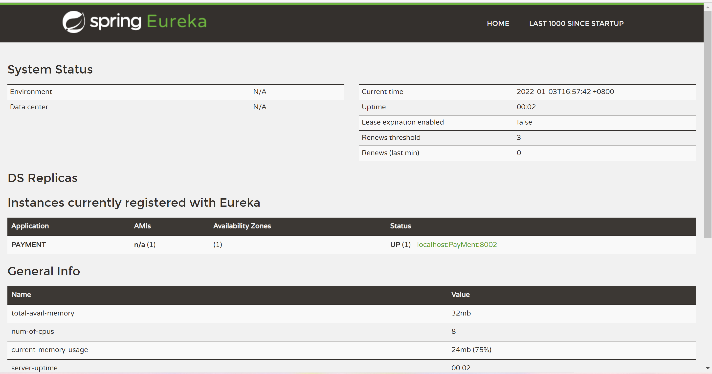

微服务的名称 就是 配置文件的spring.application.name的值

## Eureka 集群
互相注册 互相守望
## 集群 配置地址为另一台主机 主机间相互注册
                                      地址为另一台主机的地址
eureka.client.service-url.defaultZone=http://eureka2:5000/eureka

## 将消费者 注册进集群

                                         // 所有注册服务器的地址
eureka.client.service-url.defaultZone =http://localhost:8100/eureka,http://localhost:5000/eureka

## 提供者集群
  
同样 通过eureka.client.service-url.defaultZone =http://localhost:8100/eureka,http://localhost:5000/eureka
        指定多台服务器 每一个消费者用application.name 来区分功能 比如pay功能 可以有多台提供者提供 也就是applicaiton.name可以重复
                              用 port 来区分 功能里面的服务器 比如有两台服务器 都是pay功能(application-name都为pay) 端口分别为 8001 8002 则消费者访问pay功能时 就会使用轮询的方法来 进行负载均衡  
## 消费者消费
//    查看id

@RequestMapping("/consumer/serch/{id}")
public PayMent Seach(@PathVariable Integer id){
                                     // 通过微服务名称调用
return restTemplate.getForObject("http://PAYMENT"+"/serch/"+id,PayMent.class);
}

@LoadBalanced 注解开启负载均衡 给RestTemplate 赋予负载均衡的功能
@Bean
@LoadBalanced
public RestTemplate get(){
return new RestTemplate();
}

调用后 Eureka 会通过微服务名称 找到所有的服务提供者 并且自动轮询 也就做到了负载均衡

## 微服务别名
 
eureka.instance.instance-id=pay8002

## 显示ip地址在后台
eureka.instance.prefer-ip-address=true

## Day2 复习
 1 配置两个 Eureka注册中心 @Server 并且组为集群 互相监视 名字为 eureka1 eureka2 端口为 7001 7002
   @Client
 2 配置一个消费者通过RestTemplate对象进行消费 ip是微服务名! 端口为800
 3 配置两个消费者 都是Pay服务 端口为8001 8002 并且组为集群 
 4 开启负载均衡
 5 修改微服务别名
 6 显示微服务ip地址

## Day2复习成功

## Eureka 自我保护
 如果一个微服务 在一段时间内 没有心跳反应 则Eureka则会开启自我保护功能

# 如何禁止 自我保护
#  关闭自我保护
eureka.server.enable-self-preservation=false
# 心跳检查时间
eureka.server.eviction-interval-timer-in-ms=2000
# 心跳间隔检查 默认30
eureka.instance.lease-renewal-interval-in-seconds=1
# 服务端多少秒没接收到消息后自动删除微服务 默认90
eureka.instance.lease-expiration-duration-in-seconds=2

## zookeeper
与Eureka一致
application-name 还是微服务名称
spring.cloud.zookeeper.connect-string : zookeeper地址

启动类使用@EnableDiscoveryClient

## 运行zookeeper.cli
输入指令
ls /services/微服务名   可以获取一个哈希值 用这个哈希值可以获取微服务的信息
get /services/微服务名/获取的哈希值 查看微服务消息
Eureka 不能与 zookeeper 依赖共存

#  Day3 Pass (zookeeper Eureka自我保护机制)
## Day4 复习 Zookeeper 

##  什么是Consul?
与Eureka和Zookeeper一样 都是服务注册中心

服务注册与发现 检查 KV键值队 可视化Web页面
、
启动类使用@EnableDiscoveryClient
流程

POM
配置类
提供者
消费者

# 下载Consul
 下载完毕后 是一个压缩包 解压后是一个exe文件 在文件夹中打开 cmd窗口
 运行 
  consul --version 可以查看版本
  运行 consul agent -dev 后 可以在localhost:8500 访问后台界面

## 三个注册中心的异同
zookeeper  java 无界面    CP
Consul     go      有    CP
Eureka     java    有    AP

CAP: C 强一致性  A 可用性 P 分区容错性

## Ribbon负载均衡

Ribbon是一款实现 客户端（消费者） 负载均衡的工具 

Ribbon和nginx的区别

Ribbon 是一个客户端的负载均衡软件 在调用 微服务接口的时候 会在注册中心（eureka）上获取注册信息的提供者列表之后 缓存到JVM本地 从而在本地实现RPC远程服务调用技术
Nginx 是一个服务器的负载均衡软件 客户端的所有请求都会经过nginx的处理 从而实现负载均衡
RPC 远程调用技术 request-response 
# 架构
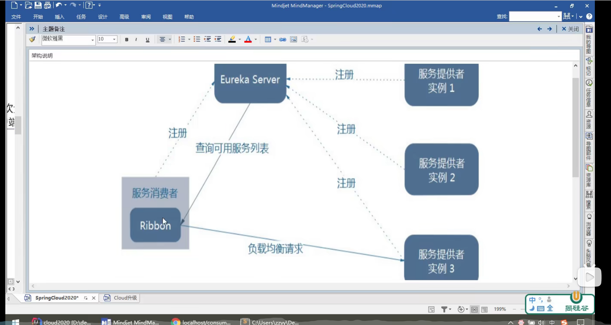
# eureka 与 ribbon
eureka的依赖中 已经包含了ribbon
# ribbon与RestTemplate
restTemplate有很多的方法
如
restTemplate.getObject()  // 获取的是响应体中数据转为的对象 可以理解为json 返回对象为CommResult<内容的对象>
restTemplate.getEntity() // 获取响应体和响应头 状态码 等等   返回对象为CommResult<内容的对象>
# 自定义负载算法
  1 不能放在componentScan的包中
 2 创建一个类 并且标记注解configuration
    用@Bean 来创建一个IRule类 具体实现类 可以查看
 3 消费者类上 添加一个注解 @RibbonClient(name="微服务名",configuration=类.class)
# IRules实现类
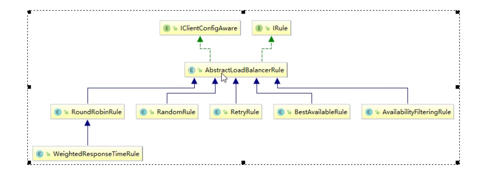
# ribbon的负载均衡 轮询算法
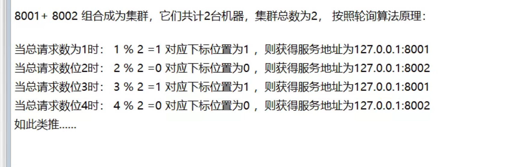
# Day4 
 创建两台Eureka注册中心 并注册为集群 互相守望
 创建两个服务提供者
 创建一个消费者 
 通过Ribbon 手写轮询算法
Provider 不要设置Host
Consumer 可以设置 
@LoadBalanced 必须写 如果要使用集群

## CAS CompareAndSet
    AtomicInteger atomicInteger = new AtomicInteger(0);

compareAndSet(当前值,期望值) 如果atomic的值等于当前值 就会更新为期望值 否则不更新 这也叫做 CAS

## 自定义轮询算法
1  创建一个接口 实例方法参数为list<ServiceInstance>   是一个列表 通过DiscoryClient.getInstances方法获取
   返回值为ServiceInstance对象 该对象就是Eureka服务
2  在实现类中 通过AtomicInteger对象和CAS思想来判断访问次数 因为只有该对象可以在高并发下保证数据安全
3  通过 访问次数%服务器数量(list<ServiceInstance>.size()) 来获取下一台的下标
4  通过下标 来调用serviceInstances.get(index); 来获取ServiceInstance对象
5  控制器对象 通过使用            uri = s.getUri(); 获取要轮询的服务器的url地址
6  return restTemplate.getForObject(uri + "/create/" + Detail, Map.class); 通过url访问微服务

 
# OpenFeign
OpenFeign 整合了ribbon和restTemplate 可以简化消费者的开发流程

# OpenFeign的思想
 与Dubbo非常的类似 都是面向接口调用 也就是调用Service接口 通过接口来实现调用
  Dubbo暴露Service的注解使用的是@Service 接收用的是@Refrence
  OpenFeign用@OpenFeign暴露  

## OpenFeign流程
1 添加@EnableFeignClient注解到启动类

2 创建一个Service接口 并且绑定微服务 和要使用的方法
@Component
//选取调用哪一个微服务
@FeignClient(value = "PAYMENT")
public interface PayService {
//    调用微服务的哪一个方法
@RequestMapping("/create/{Detail}")
public ReturnJson Create(@PathVariable(value = "Detail") String Detail);
}

3  创建一个Controller 并且通过之前的接口 来调用服务提供者的方法

@RestController
public class IndexController {
@Autowired
PayService payService;
@RequestMapping("/create/{Detail}")
public ReturnJson Create(@PathVariable String Detail){
return payService.Create(Detail);
}
}

## OpenFeign 超时控制
请求时间超过1s后 报错

## 设置超时
feign.httpclient.connection-timeout=5000

# OPenFeign日志
NONE 默认的 不显示日志
BASIC 仅记录请求方法 URL  状态码 执行时间
HEADERS 包括BASIC的信息 还有请求和响应头
FULL 包括HEADERS的信息 并且还有 请求和相应的正文及元数据

写一个配置类 并且定义Logger
@Configuration
public class FeignConfig {
@Bean
Logger.Level feign(){
return Logger.Level.FULL;
}
}

配置类中
logging.level.com.misaka.openfeignconsumer:debug

# Day5 复习 Pass
1 自写Ribbon轮询算法
    -  创建一个接口 实例方法参数为list<ServiceInstance>   是一个列表 通过DiscoryClient.getInstances方法获取
       返回值为ServiceInstance对象 该对象就是Eureka服务
    -  在实现类中 通过AtomicInteger对象和CAS思想来判断访问次数 因为只有该对象可以在高并发下保证数据安全
    -  通过 访问次数%服务器数量(list<ServiceInstance>.size()) 来获取下一台的下标
    -  通过下标 来调用serviceInstances.get(index); 来获取ServiceInstance对象
    -  控制器对象 通过使用            uri = s.getUri(); 获取要轮询的服务器的url地址
    -  return restTemplate.getForObject(uri + "/create/" + Detail, Map.class); 通过url访问微服务

2 复习OpenFeign的使用 
   - 开启OpenFeign
   - 创建一个业务接口 并且通过注解 监听对应eureka的微服务提供者 并且绑定对应的方法
   - 通过Controller调用接口方法

结果
经测试 OpenFeign的默认算法为轮询

# Hystrix 断路器 服务降级 (中级)
当微服务项目达到一定的大小时 一定会出现 A服务要调用多个服务 如果其中一个服务出现问题
那么服务就会雪崩 
 那么就要使用断路器 当某一个单元发生故障时 向调用方返回一个符合 预期 可处理的备选响应(FallBack) 而不是长时间的等待或抛出异常

# Hystrix 服务降级
如果服务器忙 就返回一个请稍后再试

 - 那些情况会服务降级 
   1 程序运行异常 
   2 超时
   3 服务熔断触发服务降级
   4 线程池/信号量打满也会导致降级
   
# Hystrix 服务熔断
 类比保险丝
  达到最大的服务访问后 直接拒绝访问 拉闸限电 然后调用服务降级的方法
 就是保险丝
# Hystrix 服务限流
 秒杀高并发等操作 严禁一窝蜂的请求 大家排队 一秒钟N个 有序进行(消息队列) 

## 通过jmeter模拟高负载环境 测试后发现消费者消费服务时 要等待时间 

## 解决方法
  - 对方的服务8001超时 调用者80不能一直等待 必须有服务降级
  - 对方的服务宕机了 调用者不能一直等待 必须要有服务降级
  - 对方的服务Ok 调用者自己出故障或有自我要求 自己的等待时间小于服务提供者 自己(80)处理降级

# 降级的方法
@HystrixCommand(fallbackMethod="服务降级方法名",commandProperties={
@HystrixProperties(name="属性",value="直“)
}) 注解 

@EnableCircuitBreaker //主启动类 的注解 
## 服务降级的方法必须返回值 必须与服务方法一致

## 限制响应时长的配置
@HystrixCommand(fallbackMethod ="fallback" ,commandProperties = {
@HystrixProperty(name = "execution.isolation.thread.timeoutInMilliseconds",value = "3000") //最长响应时间 超过就使用服务降级方法
})
## 处理降级服务的维度
 1 先处理服务提供者自身可能的问题 例如自己的最大响应时长 否则就服务降级
 2 还可以对客户端进行降级保护
    - 开启feign.hystrix.enabled:true 属性
    - 主启动类 添加开启hystrix的注解
    - 业务类添加  并添加服务降级的方法 
 @HystrixCommand(fallbackMethod ="fallback" ,commandProperties = {
 @HystrixProperty(name = "execution.isolation.thread.timeoutInMilliseconds",value = "3000") //最长响应时间 超过就使用服务降级方法
 })
    - 客户端就比服务端多了一个开启yml配置的步骤 其他一致

## 优化
 - 服务端
 如何避免 兜底方法和业务方法 在一起 避免耦合度高
  例如一种 所有的方法公用的降级方法 
 @DefalutPeoperties(defaultFallback="") 放在对应的控制器类上面
 要使用默认方法的 就是用@HystrixCommad 注解  不加value就是使用defalut
   
 - 消费端
 - 用一个类实现业务方法(openFeign的业务接口)接口 重写的方法体 也是就是fallback
 - @FeignClient(value = "PAY",fallback = PayServiceFallBack.class) 指定fallback的类
    - 不需要写@HystrixCommand标签
 - 服务器就算是宕机了 也会调用服务降级的方法

## 熔断使用的代码
//服务熔断
@HystrixCommand(fallbackMethod = "paymentCircuitBreaker_fallback",commandProperties = {
@HystrixProperty(name = "circuitBreaker.enabled",value = "true"),  //是否开启断路器
@HystrixProperty(name = "circuitBreaker.requestVolumeThreshold",value = "10"),   //请求次数
@HystrixProperty(name = "circuitBreaker.sleepWindowInMilliseconds",value = "10000"),  //时间范围
@HystrixProperty(name = "circuitBreaker.errorThresholdPercentage",value = "60"), //失败率达到多少后跳闸
})
public String paymentCircuitBreaker(@PathVariable("id") Integer id){
if (id < 0){
throw new RuntimeException("*****id 不能负数");
}
String serialNumber = IdUtil.simpleUUID();

    return Thread.currentThread().getName()+"\t"+"调用成功,流水号："+serialNumber;
}
public String paymentCircuitBreaker_fallback(@PathVariable("id") Integer id){
return "id 不能负数，请稍候再试,(┬＿┬)/~~     id: " +id;
}

## 服务熔断
熔断机制 
当一个服务不可以或者响应时间过长时 就会进行服务降级 进而熔断该节点的微服务调用 快速的返回错误的响应信息
当检查到链路恢复时 则恢复调用

## 熔断机制
@HystrixCommand(fallbackMethod = "paymentCircuitBreaker_fallback",commandProperties = {
@HystrixProperty(name = "circuitBreaker.enabled",value = "true"),  //是否开启断路器
@HystrixProperty(name = "circuitBreaker.requestVolumeThreshold",value = "10"),   //请求次数
@HystrixProperty(name = "circuitBreaker.sleepWindowInMilliseconds",value = "10000"),  //时间范围
@HystrixProperty(name = "circuitBreaker.errorThresholdPercentage",value = "60"), //失败率达到多少后跳闸
})
 如果在一个时间内 连续错误n个请求 则会自动熔断 全部返回fallback 包括正常请求
 如果正常请求的数量又变多了 则会取消熔断 恢复正常

## Day7 复习 
 Hystrix熔断(8001) fallback机制(8002)
 消费者使用openFeign的服务降级保护机制 写一个业务接口实现类.......
 
项目结构
 1 两台eureka注册中心 7001 7002
 2 两个提供者 8001 8002
 3 一个消费者 800

 

## 统一处理fallback 结构
@Component
@DefaultProperties(defaultFallback = "fallback")   //[设置全局的fallback]
public class PayServiceImpl implements PayService {
      @Override
      @HystrixCommand(commandProperties = {   //[设置属性]
         @HystrixProperty(name = "circuitBreaker.enabled",value = "true"),  //是否开启断路器
         @HystrixProperty(name = "circuitBreaker.requestVolumeThreshold",value = "10"),   //请求次数
         @HystrixProperty(name = "circuitBreaker.sleepWindowInMilliseconds",value = "10000"),  //时间范围
         @HystrixProperty(name = "circuitBreaker.errorThresholdPercentage",value = "60"), //失败率达到多少后跳闸
      })
      public String pay(int id) {
          if(id<0){
          throw new RuntimeException("错误呐");
          }else
          return "成功";
      } 
      public String fallback(){
          return "fallback";
      }
   }
## 消费者端的加固
@Component
@FeignClient(value = "PAY",fallback = OpenFeignFallback.class) //指定实现类 其中所有的重写方法就 就是对应的fallback
public interface OpenFeign {
    @RequestMapping("/pay/{id}")
    public String pay(@PathVariable("id") int id);
}

## 服务熔断小总结
     @HystrixProperty(name = "circuitBreaker.enabled",value = "true"),  //是否开启断路器
         @HystrixProperty(name = "circuitBreaker.requestVolumeThreshold",value = "10"),   //请求阈值
         @HystrixProperty(name = "circuitBreaker.sleepWindowInMilliseconds",value = "10000"),  //快照时间窗
         @HystrixProperty(name = "circuitBreaker.errorThresholdPercentage",value = "60"), //失败率
涉及到熔断的三个重要参数 快照时间 请求总数 错误百分比

1 快照时间 断路器是否打开需要统计一些请求和错误数据 而统计的时间范围 就是快照时间窗 默认为最近的10s
2 请求总数阈值 在快照时间内 必须满足请求总数 阈值才有资格熔断 默认为20 意味着在10s内 如果该hystrix命令的调用次数不足20次
即使所有的请求超时或失败 断路器都不会启动
3 错误百分比 在请求总数在快照时间中超过了阈值 比如发生了30次调用 如果在30次中 失败了15次
也就是50%失败率 在默认情况下(50%) 断路器就会开启

## hystrix 服务监控
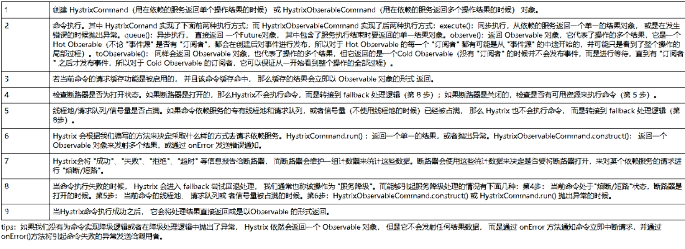

## hystrix可视化 界面
该界面 是单独的一个监控者 所以要创建一个 并且 添加一个依赖

    <!--新增hystrix dashboard-->
        <dependency>
            <groupId>org.springframework.cloud</groupId>
            <artifactId>spring-cloud-starter-netflix-hystrix-dashboard</artifactId>
        </dependency>

监控者加注解
@EnableHystrixDashboard
监控者地址 localhost:xxx / hystrix
http://localhost:802/hystrix

所有Provider微服务提供类（8001/8002/8003）都需要监控依赖配置
<dependency>
<groupId>org.springframework.boot</groupId>
<artifactId>spring-boot-starter-actuator</artifactId>
</dependency>

并且在主启动类上面写
@Bean
public ServletRegistrationBean getServlet(){
HystrixMetricsStreamServlet streamServlet = new HystrixMetricsStreamServlet();
ServletRegistrationBean registrationBean = new ServletRegistrationBean(streamServlet);
registrationBean.setLoadOnStartup(1);
registrationBean.addUrlMappings("/hystrix.stream");  // 监控地址的后缀 xxx:xxx/xxx  http://localhost:7001/hystrix.stream
registrationBean.setName("HystrixMetricsStreamServlet");
return registrationBean;
}
 

## 监控图解
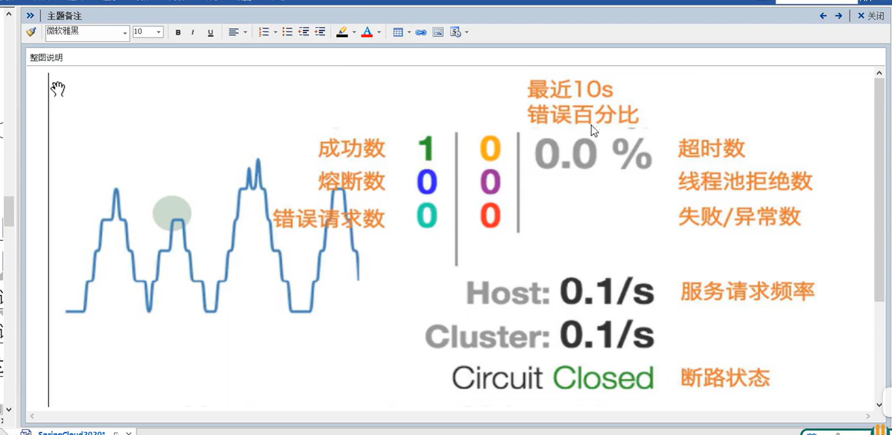

## GateWay Zuul(已过气) 网关
 - GateWay 是什么?
  

## GateWay 三大核心概念
 - 路由
  路由是构建网关的基本模块 它由ID 目标URI 一系列的断言和过滤器组成 如果断言为true 则匹配该路由
 - 断言
  开发人员可以匹配HTTP请求的所有内容 (请求头 请求参数 ) 如果请求与断言相匹配 则进行路由
 - 过滤
  不是拦截器!!!
    指的是Spring框架中GateWayFillter的实例 使用过滤器 可以加强请求 也就是在请求被路由接收或之后 进行对请求的加强 例如
    -- 获取前
       权限校验 流量监控 日志输出 协议转换(http->ws)
    -- 获取后
       响应内容 响应头的修改 日志的输出 流量监控
   

## 网关的作用 
将真正的服务端口例如8001 上面套上 一层网关的端口 所有的请求必须通过网关撒选通过

## 网关的配置

# 路由的id 没有规则但是必须为唯一值 最好为服务名
#http://localhost:7001/pay/1 给这个网址赋予一个网关
spring.cloud.gateway.routes[0].id=gateway-service
#路由会访问的路径
spring.cloud.gateway.routes[0].uri=http://localhost:7001
#会访问的uri 可以使用通配符
spring.cloud.gateway.routes[0].predicates[0]=Path=/pay/**

routes是一个list 可以配置多个路由

## ! GateWay的坑
Parameter 0 of method modifyResponseBodyGatewayFilterFactory in org.springframework.cloud.gateway.config.GatewayAutoConfiguration required a bean of type 'org.springframework.http.codec.ServerCodecConfigurer' that could not be found.
该报错是因为 GateWay底层使用的是WebFlux 而不是Web 所以要把 spring-boot-starter-web 依赖删除 如果要使用web服务 则要使用webflux依赖

## 解决
 <dependency>
            <groupId>org.springframework.boot</groupId>
            <artifactId>spring-boot-starter-web</artifactId>
            <!-- Maven整个生命周期内排除内置容器，排除内置容器导出成war包可以让外部容器运行spring-boot项目-->
            <exclusions>
                <exclusion>
                    <groupId>org.springframework.boot</groupId>
                    <artifactId>spring-boot-starter-tomcat</artifactId>
                </exclusion>
            </exclusions>
        </dependency>
        <dependency>
            <groupId>org.springframework.boot</groupId>
            <artifactId>spring-boot-starter-webflux</artifactId>
        </dependency>

## 通过网关访问
http://localhost:9527/pay/-1    // 可以掩盖原端口号
## 通过编码跳转网关路由
创建一个COnfig类 里面用@Bean实例化一个RouteLoctor对象 并且有一个参数RouterloctorBuilder

@Configuration
public class Config {
      @Bean
      public RouteLocator routeLocator(RouteLocatorBuilder routeLocatorBuilder) {
          RouteLocatorBuilder.Builder builder = routeLocatorBuilder.routes();
          // id                   // 路由               //映射路径 http://baidu.com/hello
          builder.route("test", r -> r.path("/hello").uri("https://baidu.com")).build();
          // id                   // 路由               //映射路径 http://localhost:7001/pay/**
          builder.route("testx", r -> r.path("/pay/**").uri("https://localhost:7001")).build();
          return builder.build();
    }
}

## Day8 Pass
复习 hystrix 服务降级(消费端 服务端) 熔断(消费端 服务端) 图形化显示(9001)
复习 gateWay 路由配置 properties配置 路由代码设置\

## GateWAY的动态ip设置
# 开启微服务名访问功能 以便于服务集群的使用
spring.cloud.gateway.discovery.locator.enabled=true
 - 然后                                            //使用微服务名字 并且协议为lb
   route.route("Pay", r -> r.path("/pay/**").uri("lb://pay")).build();

## Predicate
第二大特性 断言
设置多个断言
spring.cloud.gateway.routes[0].predicates[0]=Path=/pay/**
spring.cloud.gateway.routes[0].predicates[1]=After=2022-01-16T19:04:42.802+08:00[Asia/Shanghai]

    // Path也是断言的一种
spring.cloud.gateway.routes[0].predicates[0]=Path=/pay/**
断言的类型 通过之前的知识点知道 一个网关的请求 必须要通过断言的审核才能进入到路由转发环节

After 在指定的时间之后 断言为true
如
spring.cloud.gateway.routes[0].predicates[0]=After=2022-01-16T19:04:42.802+08:00[Asia/Shanghai]

Before 时间与After 同类型 之前
Between 时间与After 同类型 之间

Cookie 检查请求是否带上cookie 或者cookie是否正确 例如 该cookie必须有对应的key
 Cookie = username,misaka   要求cookie必须要有一个key 为username value为misaka
spring.cloud.gateway.routes[0].predicates[2]=Cookie=username,misaka

Header 请求头的断言
 Header=hello.xx   请求头中必须含有hello 属性 值为xx 值可以为正则表达式
Host
  域名 localhost。。。
Method
  方法 Get..
Path
  路径 /pay/** 
Query
  get参数 key=value value可以为正则表达式
ReadBody
RemoteAddr
Weight
CloudFoundryRouteService

## Filter
三大特性 过滤器

生命周期 
 pre post

种类
 GateWayFilter
 GlobalFilter

自定义过滤器
 1 实现两个接口 GlobalFilter,Ordered

@Component
public class Filter implements GlobalFilter, Ordered {
     @Override
     public Mono<Void> filter(ServerWebExchange exchange, GatewayFilterChain chain) {
            System.out.println("***come in Filter");
            //        获取请求的参数
            String uname= exchange.getRequest().getQueryParams().getFirst("uname");
            if(uname==null){
            System.out.println("为空");
            //            设置状态码
            exchange.getResponse().setStatusCode(HttpStatus.NOT_ACCEPTABLE);
            //            返回结果
            return exchange.getResponse().setComplete();
            }
            //        正常返回
            return chain.filter(exchange);
     
         }
@Override
     //    加载过滤器实现类类的顺序 值越小 优先级越高 类似加权重
     public int getOrder() {
           return 0;
     }
}

## Day9 Pass
复习

dashborder
熔断
fallback
多个断言设置 
filter

## Config 分布式配置中心
 微服务意味着 要将单体应用的业务拆分成一个个的子服务 每一个服务的粒度较小 因此系统中会出现大量的服务 由于每一个服务
都需要必要的配置信息才能运行 所以一套集中式 动态的配置管理是必不可少的
 springCloud 提供了 ConfigServer 来解决这个问题 我们每一个微服务自己带着一个application.Yml 上百个的配置文件管理就会十分的麻烦 例如mysql的迁移》。。
Config也是一个微服务(也要注册到注册中心中) 只不过是提供服务配置的微服务

 
一般和Git一起使用

#步骤
 1 创建一个仓库在github里面 专门用于存储config的yml文件
 2 创建 Yml并且配置 并且注册到eureka中
# GitHub的仓库名字
spring.cloud.config.server.git.uri=git@github.com:shuaipengcheng1/SpringCloud_Config.git
# 配置文件目录 是一个数组  config文件夹
spring.cloud.config.server.git.search-paths[0]=config
# 读取的分支
spring.cloud.config.label=master
 3 设置注解 @EnConfigServer
 4 启动
 5 访问 http://localhost:3344/master/bulid.properties
                      端口    分支    文件

 # Config的访问机制
  统一前缀  http://域名:端口
  
  标准  /{label}-{name}-{profiles}.yml
         分支     文件名    环境(dev...?)
      所以配置文件的名字必须为 xxx-dev.properties
 
 ## 消费端
 -- 消费端设置 需要使用bootStrap.yml or properties 作为配置文件
 application.yml 使用户级别的资源管理配置项
 bootstrap.yml是系统级的配置 优先级高

 要将client的application.yml改为bootstrap.yml 这是非常非常关键的
# config
spring.cloud.config.uri=http://localhost:3344 //服务端地址
spring.cloud.config.label=master  // 线程
spring.cloud.config.name=config   // 文件名
spring.cloud.config.profile=dev  // 文件类型   
支持COnfig的文件名字规则   xxx-类型.properties or yml;
                       例  config-dev.properties

 然后通过 label name profile config服务地址 四大元素 来获取对应的文件
 最后通过rest风格暴露配置
 @RestController
 public class index {
     @Value("${config.dev}") //获取在github上配置文件的数据 如 文件内部属性config.dev=xxxx   这里就可以获取到 xxx
        String config;
     @RequestMapping("/config")
     public String p(){
        return config;
      }
}
## Config 的动态刷新
 如果在github修改文件的内容 Config服务端会立即刷新 但是客户端不能 所以出现了问题 因为不能每次修改都重启微服务...

 - 步骤
  1 添加actuator依赖
    2 暴露监控端口 让所有服务可以监控
    management.endpoints.web.exposure.include="*"
    3 在Rest暴露对象(Controller)上面 添加一个注解 @RefreshScope 
    4 就可以通过发送一个Post请求 给 消费者 消费者就会自动更新 请求的url http://消费者/actuator/refresh
   

 
## Bus 消息总线

 Spring Bus 是可以使Config可以广播Post 让所有/指定 的消费者 更新 而不是手动更新 或者脚本更新
 Bus支持两种消息代理 RabbitMQ 和 Kalka
## Bus 图解
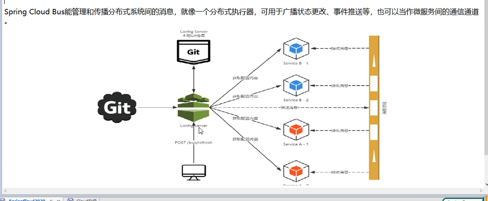

## Bus 在RabbitMq中 主题模式默认为 Topic 正则表达式模式 *.xx.* * 为任意单词
                        ## RabbitMQ模式 direct topic fanout 

## Bus 两种设计思想 
  1 利用消息总线 触发一个客户端 /bus/refresh 而刷新所有客户端的配置
  2 利用消息总线触发一个服务端 ConfigServer 由服务端 刷新所有客户端的配置
  第二种显然更加的适合 

## Bus 步骤
 1 添加消息总线的支持 在COnfigServer上面
 <!--        添加消息总线和 监控的依赖-->
        <dependency>
            <groupId>org.springframework.cloud</groupId>
            <artifactId>spring-cloud-starter-bus-amqp</artifactId>
        </dependency>
 2 在配置文件中配置rabbitmq的配置
 3 暴露端口   bus-refresh
 4 在消费者上面 添加总线和监控的依赖 并且添加rabbitmq配置 暴露端口 *

配置通过总线刷新，只需在配置中心服务应用上访问如下链接，就能通知所有应用： curl -X POST "http://localhost:3344/actuator/bus-refresh"
http://localhost:3301/actuator/bus-refresh

如果只想让某个应用更新：
http://localhost:3301/actuator/bus-refresh/pay-center:8086

其中3301是配置中心的端口
pay-center是具体的应用名 微服务名
8086是pay-center中某个启动的应用的具体端口

## Day11
 Config的消费者 服务端配置  Bus的消息总线应用 一次刷新 全部生效 RabbitMq配置 监控端口暴露
 hystrix dashborder
 hystrix 熔断
 gateway fallback
 gateway 多个断言设置
 gateway filter
 eureka注册中心
 1 将hystrix 消费者 集成 Config(可以获取在线的yml文件) 并且设置一个rest风格api 
 2 网关保护后 服务者请求是访问网关ip哦 也就是不暴露提供者的ip地址 并且可以使用Filter加强访问 或者用断言限制访问
 3 记得在ConfigServer上面添加MQ依赖 和 BUS的依赖

 PASS!

# Stream
解决的痛点
 MQ 消息中间件
    ActiveMQ
    RocketMQ
    Kafka
    RabbitMQ 
MQ 有很多个 如果每一个都学就会非常的累
   这时stream就是用来解决这个问题的技术

目前仅支持 RabbitMQ 和 Kafka
    
类似 JDBC 可以同时操作 mysql数据库 SqlServer数据库 Oracle数据库

 - 设计思想
    1 标准MQ
      Provider ---message----> Exchange -----routerkey--->Queue---routerkey-->Consumer
                  channel 
    2 引入了Stream后 
      像RabbitMQ 有 exchange 
      像Kafka有 Topic 和 Partitions 分区 
     
    3 Binder思想
      INPUT 对应消费者 
      OUTPUT 对应生产者
      
    4 底层流程
     生产者发送消息给Stream中间件 中间件中含有三个属性 Source(资源) Channel(信道) Binder(绑定器)
         然后Stream会自动发送消息到RabbitMQ或者Kafka 开发人员不需要在意底层实现
     消费者从Stream中接收消息 通过三个属性 Sink(消息) Channel(信道) Binder(绑定器) 
   # 底层图解
   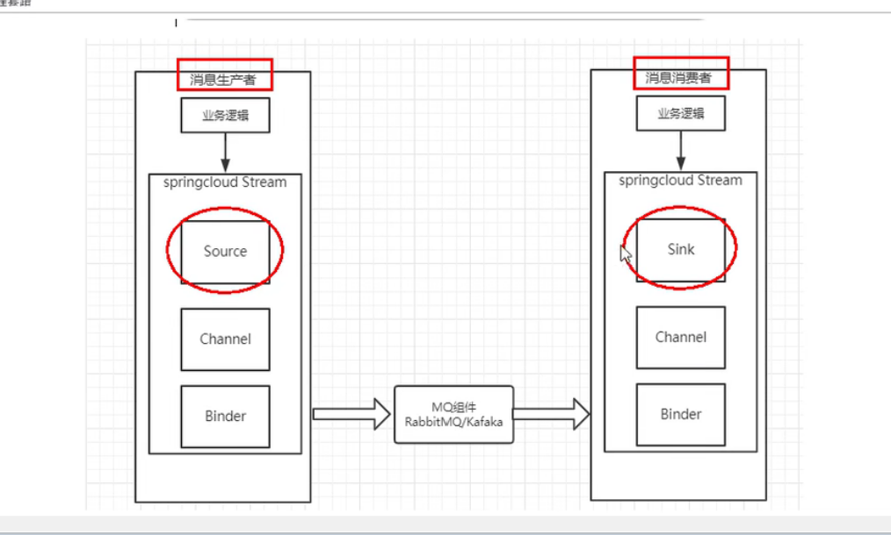
# Stream 编码API 常用注解
MiddleWare 中间件 目前只有两种支持
Binder 该应用是应用于消息中间件的封装 目前使用了RabbitMQ的和Kafka的Binder 通过Binder 
       可以很方便的链接消息中间件 可以动态的改变消息类型(Rabbit的exchange或者Kafka的Topic)
       这些都可以通过yml文件实现
@input 注解标识输入通道 通过该输入通道接收的消息进入应用程序 
@OutPut 标识输出通道 发布的消息通过该通道离开应用程序
@StreamListener 监听队列 用于消费者的消息接收 等于@RabbitListener
@EnableBinding 指信道channel和exchange绑定到一起

# 项目API
1 RabbitMQ环境
2 8001 生产者
  8002 接收
  8003 接收

## Stream消费者 和 生产者的配置文件区别
 - 消费者
spring.cloud.stream.bindings.input.binder=defaultRabbit
spring.cloud.stream.bindings.input.content-type=application/json
spring.cloud.stream.bindings.input.destination=normalexchange

 - 生产者
spring.cloud.stream.bindings.output.destination=normalexchange
spring.cloud.stream.bindings.output.content-type=application/json
spring.cloud.stream.bindings.output.binder=defaultRabbit

 - output变为了input

## 通道类 注解的差别
 - 消费者
@EnableBinding(Sink.class)
    - 生产者
      @EnableBinding(Source.class)

## 消费者接收消息
    @StreamListener(Sink.INPUT)
    public void message(Message<String> message){
        System.out.println("我是消费者 消息为"+message.getPayload());
    }
## 提供者发送消息
    public  MessageChannel channel; // 消息发送管道
channel.send(MessageBuilder.withPayload(map).build());

## Stream对RabbitMQ的作用
1 在任意通道(消费者or生产者)启动成功后 则会创建对应的exchange
2 channel会被自动创建 
 

## 分组消息(避免多次消费Fanout)
问题 如果多个消费者 就会多次消费 (因为默认的routerKey为# 所以会发给每一个channel) 如果消息为订单 就会被消费两次 所以要解决这个问题
 所以Stream有一个概念 叫做Group组
 同一个组下的消费者为竞争关系 只有一个可以消费
 不同组可以重复消费
其实就是队列 不同队列可以重复消费 但是相同队列不可以重复消费
默认情况 Stream会给每一个消费者创建一个队列 名字随机 并且用#作为Routerkey值 这时exchange的策略 类似FanOut(一个消息 发给所有的Queue)
     - 修改
       我们自定义Queue的名字 如果当前交换机的内容我们不允许重复消费 我们就可以将queue的名字设为一个值 使消费者变为竞争关系 就可以避免重复消费
- 实现
  spring.cloud.stream.bindings.input.group=test 设置队列名称
  
- 测试
发送消息后 确认消息不会被重复消费 并且算法为轮询 (请求次数%消费者数量=下标)
  
## 持久化
 如果设置了Group属性 则该队列自动为durable:true (持久化开启)

## Sleuth 分布式请求链路跟踪
 在微服务中 一个请求 会在后端系统中经过不同的微服务 如果业务逻辑复杂 则可能会经过很多的微服务
 如果出现了错误 那么不好排查问题  Sleuth就是监控微服务请求的

## 搭建sleuth监控
 1 下载zipkin
   - java -jar zipkin.jar 运行jar包
   - http://localhost:9411/zipkin/ 监控图像默认路径
 2 要监控的引入依赖spring-cloud-starter-zipkin 
 3 配置类
     spring.zipkin.base-url=http://localhost:9411

## Day12 Pass
复习
  Stream 的消费者的消息轮询(单次消费)  持久化
  Stream 的服务提供者的配置
  Eureka 的搭建
  Zipkin 的搭建 并且监控

## SpringCloud Alibaba SpringCloud高级篇
主要功能           SpringCloud      SpringCloudAlibaba
1 服务降级和限流    Hystrix         
2 服务注册和发现    Eureka     -->    Nacos
3 分布式管理       
4 消息驱动能力      Stream    
5 阿里云对象存储   
6 分布式任务调度

# Nacos 服务注册(Eureka)和配置(Config,Bus)中心
Nacos就是注册中心+配置中心
替代Eureka做服务注册
替代Config做服务配置
版本选择 1.1.4

## 启动nacos
http://localhost:8848/nacos/#/login 该页面 为图形化管理页面 默认的账号密码都是nacos 
 上面一步操作完毕后 就相当于一个单机版的eureka已经启动了

## Nacos 服务提供者搭建
 1 添加nacos 依赖
 <dependency>
 <groupId>com.alibaba.cloud</groupId>
 <artifactId>spring-cloud-starter-alibaba-nacos-discovery</artifactId>
 </dependency>

  2 添加 actuator 依赖
 <dependency>
 <groupId>org.springframework.boot</groupId>
 <artifactId>spring-boot-starter-actuator</artifactId>
 </dependency>

 3 主启动类添加 @EnableDiscoveryClient 注解
 
## 第一个项目
 1 创建两个消息提供者
  2 创建一个GateWay 保护提供者 
  3 创建一个消费者 使用openFeign来实现远程调用(RPC)
 技术栈 SpringCloudAlibaba+ Nacos + GateWay+OpenFeign
    PASS!
 
-- 总结 ： 使用Controller记得加Web依赖！！
          Nacos默认就是负载均衡 lb  策略是轮询 访问次数%服务器数量=index

# Nacos和其他注册中心的区别

Nacos 支持 AP+CP 模式

# Nacos替代CONFIG+BUS(服务配置)
1 添加依赖
     <dependency>
            <groupId>org.springframework.cloud</groupId>
            <artifactId>spring-cloud-starter-alibaba-nacos-config</artifactId>
            <version>0.9.0.RELEASE</version>
        </dependency>
2 配置
#注册到注册中心
spring.cloud.nacos.discovery.server-addr=localhost:8848
#  将nacos作为服务配置中心
spring.cloud.nacos.config.server-addr=localhost:8848
# 设置要读取的文件类型
spring.profiles.active=dev 
spring.cloud.nacos.config.file-extension=properties
spring.cloud.nacos.config.prefix=config

- 3 支持动态刷新
//在Controller上面添加注解保证动态刷新
@RefreshScope

- 4 Nacos配置文件格式
微服务名-开发环境.properties
例如
config-dev.properties
- 5 读取
spring.profiles.active=dev  //开发环境
spring.cloud.nacos.config.file-extension=properties //文件类型
spring.cloud.nacos.config.prefix=config  //文件名
  
 // 上面的配置就会匹配这个文件
config-dev.properties 

## Nacos 分类配置
 - 命名空间 默认为public
   - 组 默认为 DEFAULT_GROUP
     - Data Id 数据id 也就是微服务
 - 分类 Nacos的底层通过 NameSpace+GROUP+DATA ID 三部分组成
        类似java的包名和类名
   
- 操作
  1 命名空间 默认为public 可以使用命名空间来实现隔离 
      例如现在有三个环境 开发 测试 生产 我们就可以创建三个命名空间 他们互相是隔离的
  2 组 可以把微服务放在同一个组中
  3 Dateid 一般为环境
  
- Data id 隔离方案
  默认空间+默认分组+新建dev和text两个Date id 就能进行多环境的读取
  [图示]
  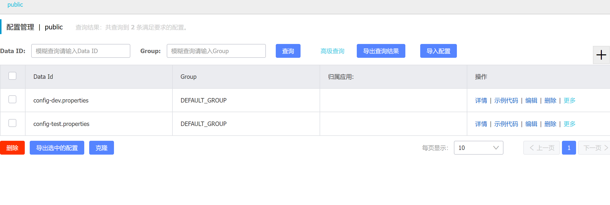
  配置后 切换环境 就可以通过下面的代码进行修改 例如从dev改为test 就可以直接修改为 test 不需要其他操作
  spring.profiles.active=dev  //开发环境
  **其他的方案同理 例如Group或者namespace**
  
## Nacos 集群配置 持久化配置
 - 集群原理图解
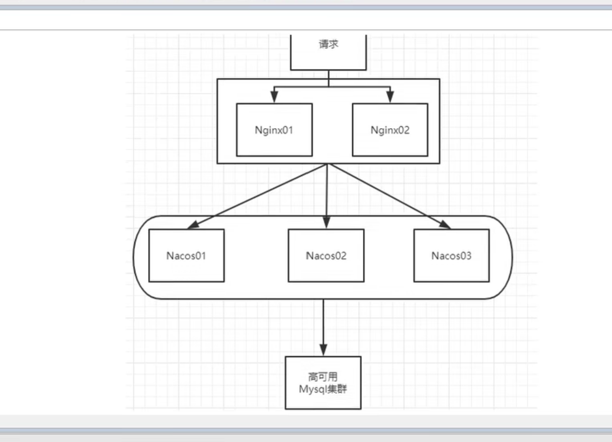
   
 - 持久化配置
  Nacos默认自带的是嵌入式数据库derby 每一个Nacos都有自己的derby数据库 所以可能会出现数据不同步 所以官方推荐使用mysql数据库作为数据中心 来保证数据的高可用
   -操作 切换数据库
   1  nacos-server 1.1.4\nacos\conf目录下找到 nacos-mysql.sql 放在数据库中执行
   2 修改 nacos-server 1.1.4\nacos\conf下的application.properties的内容
      在里面添加
spring.datasource.platform=mysql
db.num=1
db.url.0=jdbc:mysql://localhost:3306/nacos_config?serverTimezone=UTC&characterEncoding=utf8&connectTimeout=1000&socketTimeout=3000&autoReconnect=true
db.user=root
db.password=spc652324
    3 修改为单机 standalone
    4 修改时区 ?serverTimezone=UTC
   
# 通过nginx 搭建nacos 集群
 - 原理与架构
 预计需要 一个nginx 3个nacos 1个mysql
            一个server挂载三个nacos服务器 [并且为了避免都是8848端口 所以启动命令使用 startup -p 端口]  并且将数据库改为 mysqlserver挂载的数据库地址
   图解
                mysqlServer
                                   ----> nacos1:3333
 请求 ----> server--->nginx(负载均衡)----> nacos2:4444
                                   ----> nacos3:5555
   
 - 搭建步骤
   1 下载对应nacos版本的tar包 并且解压
    2 将mysql脚本文件的内容 写入mysql
    3 mysql 密码 0zd>lApjgp6s  mysql  -umisaka -pspc652324 -uroot -pspc652324 
      - 启动Mysql
        systemctl start mysqld.service
         - 关闭安全保护
 setenforce 0
    4 配置nacos的 cluster配置文件 并且设置三台nacos的ip地址 要网卡ip  192.168.194.128:port 因为要暴露给nginx使用
           192.168.194.128:3333
           192.168.194.128:4444
           192.168.194.128:5555
   

   5 设置nacos的 application.conf文件 添加数据库依赖
   spring.datasource.platform=mysql
   db.num=1
   db.url.0=jdbc:mysql://127.0.0.1:3306/nacos_config?serverTimezone=UTC&characterEncoding=utf8&connectTimeout=1000&socketTimeout=3000&autoReconnect=true
   db.user=root
   db.password=spc652324
   
  6 编辑nacos的启动脚本 startup.sh的代码 修改为 -p可以指定端口号
     - 添加一个-p的选项 
       执行的代码为 EMBEDDED_STORAGE=$OPTAGS
     - 在执行脚本上面添加
nohup $JAVA [-Dserver.port=${EMBEDDED_STORAGE}] ${JAVA_OPT} nacos.nacos >> ${BASE_DIR}/logs/start.out 2>&1 &  //注意这里-Dserver "-"之后没有空格

  7 nginx的修改
         1 设置nginx的负载均衡配置
       upstream cluster{
      server 192.168.194.128:3333;
      server 192.168.194.128:4444;
      server 192.168.194.128:5555;
       }
        2 设置nginx的监听和方向代理端口
       server{
       listen 80;   //监听192.168.194.128:80
       server_name he;
       location / {
       proxy_pass:http://cluster;  //如果满足192.168.194.128:80/** 自动转为 http://cluster/**
       }
       }

 8 运行nginx 
    nginx命令

 9 运行三台nacos
 ./startup.sh -p 3333
 ./startup.sh -p 4444
 ./startup.sh -p 5555
 ！！！！ 注意事项
  [运行nacos之前如果使用的是高版本mysql 需要在根目录下面 添加一个plugins文件夹 里面放mysql-connector-java.jar包]
  [application.properties的mysql配置 db.url.0=jdbc:mysql://必须为127.0.0.1格式的ip地址 不能为localhost]
 正确的配置
 spring.datasource.platform=mysql
 db.num=1
 db.url.0=jdbc:mysql://127.0.0.1:3306/nacos_config?serverTimezone=UTC&characterEncoding=utf8&connectTimeout=1000&socketTimeout=3000&autoReconnect=true
 db.user=root
 db.password=spc652324

10 修改占用内存
if [[ "${MODE}" == "standalone" ]]; then
JAVA_OPT="${JAVA_OPT} -Xms256m -Xmx256m -Xmn256m"
JAVA_OPT="${JAVA_OPT} -Dnacos.standalone=true"
else
if [[ "${EMBEDDED_STORAGE}" == "embedded" ]]; then
JAVA_OPT="${JAVA_OPT} -DembeddedStorage=true"
fi                        /  默认为2g 改为256m
JAVA_OPT="${JAVA_OPT} -server -Xms256m -Xmx256m -Xmn256m -XX:MetaspaceSize=128m -XX:MaxMetaspaceSize=320m"
JAVA_OPT="${JAVA_OPT} -XX:-OmitStackTraceInFastThrow -XX:+HeapDumpOnOutOfMemoryError -XX:HeapDumpPath=${BASE_DIR}/logs/java_heapdump.hprof"
JAVA_OPT="${JAVA_OPT} -XX:-UseLargePages"

总结
 其实nacos的集群的搭建是基于nginx的负载均衡来实现的 不像eureka是自己实现的
    - 将一个请求 轮询分配给每一个服务器 nacos2222 3333 4444....

单机器启动nacos集群，如果多个nacos进程访问的是同一个目录 {nacos.home}的话，会因为锁机制，后续的进程无法启动。
所以，让不同的节点访问不同的 {nacos.home}吧，在 idea里面就可以实现同时启动多个进程。(不能在同一台虚拟机上面开多个nacos)
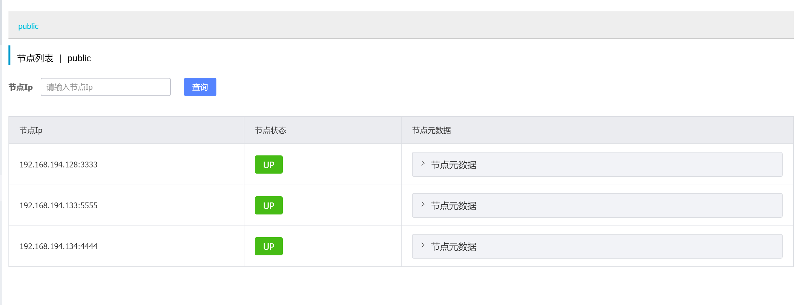
## Day13 复习              
nacos的搭建 服务提供者集群 gateway网关保护服务者的/info/**路径 必须使用post请求 并且id>1
服务消费者通过openfeign消费gateway
nacos的服务配置功能(替代config+bus) 服务配置的格式 {prefix}-{profile}.{file-extension} 配置多个config实现配置隔离
Stream的RabbitMq实现

PASS!
# sentinel(Alibaba的推荐的服务降级 熔断 限流的组件)
 这个组件就是hystrix
 并且拥有图形化管理界面
 
## sentinel下载
1 通过github获取 jar包

# sentinel核心为两个部分
 1 核心库 (Java客户端) 不依赖任何框架 能够运行在所有java运行时环境 同时对Dubbo/Spring CLoud等框架也有较好的支持
  2 控制台(dashBorder) 基于springboot开发 不需要任何额外的web容器 例如(Tomcat,netty..)
 3  下载为sentinel-dashboard-1.7.0.jar版本
 java -jar sentinel-dashboard-1.7.0.jar --server.port=9999 启动端口设置！

 
# sentinel端口默认为8080!!!与Vue冲突 账号密码都是sentinel

## 初识sentinel
  - 添加sentinel依赖
  - 搭建一个微服务 并且注册到nacos中 并且同时注册到sentinel中
* 微服务注册进sentinel时 sentinel不会立马加载 而是会等微服务执行一次后再加载 也就是lazy load机制

# sentinel流控规则
 1   QPS（Request per Seconds） 每秒请求
   如果请求的QPS大于limit 则直接失败
 2 线程限流(TPS Thread per Seconds)
   如果同时有多个线程访问一个服务 如果开启了TPS 则除了第一个请求后续请求全部失败
    类似于线程锁 上一条线程处理结束 下一条线程则可以进入
# sentinel的流控方法
 1 关联 
    如一个controller下面的两条RequestMapping路径 通过关联可以实现 B服务关联A服务  A路径如果达到阈值 关闭B路径
          也就是例如 /pay/1 关联/test 并且设置QPS为1 如果/test的QPS大于1 则/pay/1 将会关闭
   例如 支付接口达到阈值 则关闭下订单的接口
 ## sentinel流控效果
 1 直接失败 
    默认选项 直接报错 
 2 WarmUp 预热
    例如 0的QPS直接达到10w的QPS 如果没有任何防护 服务器很容易宕机
        所以有一种技术冷启动 会在一定的时间内将服务器拉升到能够接收的阈值上限
   - example 
       /testA 的路径单机阈值为10 并且设置效果为WarmUp 时长为5 
       阿里巴巴底层的初始阈值公式为 
        最终阈值(设定阈值)  /   3(默认值) = 初始阈值
       也就是/testA的初始阈值是 10/3 =3 并且会在5s内升到10的阈值
     一旦停止访问 QPS就会回到 [最终阈值(设定阈值)  /   3(默认因子) = 初始阈值] 的值
     
 3 排队等待
    也就是一堆的请求进来 也只能挨个处理 也就是一个Queue(队列) 
     阈值为能够同时处理的请求数量 越多 队列就会越快
     该模型底层使用了漏桶算法
   业务场景为 每一次接收了大量的请求后 有一定的空闲时间 可以使用排队 使用这个方法可以避免直接拒绝请求

## sentinel的服务降级
  - RT（平均响应时间 秒级）
    平均响应时间超出阈值(RT值) 且 1s内至少发出5个请求  两个条件同时满足触发服务降级
    窗口期内熔断  窗口期过后关闭熔断
    
  - 异常比例(秒级)
    QPS=>5 且异常比例超出阈值(在1s内) 触发降级 
     窗口期内熔断  窗口期过后关闭熔断
    Alibaba的异常比例 为0.0 -1.0 的数值 也就是0%-100%
    
  - 异常数(分钟级)
    异常数(1分钟内) 超过阈值的时候 触发降级
    窗口期内熔断  窗口期过后关闭熔断
    时间窗口要大于60
    
## sentinel热点key的限流
 - 热点限流 就是根据一个Key的值 来进行一个精准限流 例如要限制某一个商品的QPS等等
 例 
    - 现在一个热点的rest地址为 http://localhost:8801/query?id=1
       热点限流可以准确的限制到参数id=1的 而不是整个rest限流
      
 热点限流仅支持QPS规则
  如
   限制一个资源的QPS不能超过n 如果超过了n/QPS 那就调用BlockHandler属性的方法

 - 上面的演示了如何限制某一个rest路径的第一个参数 
   第二种场景 
   例 
  /pay的第一个参数 除了?p=5时限流 其余的不限流
      - 在热点规则的高级设置中有选项 内容支持java八大数据类型
     
  - 还可以用于区别对待vip客户和普通用户 通过判断参数 来区别QPS的大小 可以提升vip的体验
 

## sentinel的fallback
 1 默认的fallback
   之前的case都是使用的默认的方法 客户端会提醒一个 Blocked by sentinel(flow limiting)
 2 自定义的fallback
   以前的Hystrix的fallback的设置是通过 @HystrixCommand注解里面的fallback属性 自定义处理函数
   sentinel也提供了注解 为@SentinelResource
   [注解使用]
 //    设置fallback
                  // 唯一标识可以作为资源名                兜底方法 专门用于处理sentinel的超阈值等等 
    @SentinelResource(value = "hotKey",blockHandler = "deal_Hotkey") //该注解有fallback属性 用于处理java运行时异常
    public String get(@RequestParam(value = "p1",required = false) String p1){
           System.out.println(p1);
           return p1;
    }
 //                          传入参数         该参数必须
    public String deal_Hotkey(String p1, BlockException  blockException){
        return  "兜底";
    }

## sentinel的系统规则(整个系统 而不是一个rest地址)
参数 
     load指标
     cpu
     平均RT(响应时长)
     并发线程数
     入口QPS
     
## Sebtinel设置全局BlockHandler
1 @SentinelResource的注解中有一个 blockHandlerClass属性 可以选择类
   该类的方法必须和requestmapping方法的返回值一致 并且必须为static
2 注解
                      唯一值                          使用的类                   使用的类里面对应的处理方法
    @SentinelResource(value = "string",blockHandlerClass = StringHandler.class,blockHandler = "s")

## sentinel热点规则
 1 参数索引
   也就是参数的下标 比如第一个参数 索引就是0
## sentinel的@SentinelResource注解 
  fallback属性 专门用于处理java错误 如 空指针异常 ....
  blockHandler属性 专门处理sentinel控制台错误如RPS TPS 热点..
  exceptionsToIgnore属性 value为 IllegalArgumentException.class 该属性可以在开发时使用 可以直接无视fallback 前台会展示

 所以一般两个属性都要进行配置 防止出现 如error page的不美观报错

## sentinel的客户端的保护 也就类似于hystrix的客户端配置
sentinel+OpenFeign or Ribbon Ribbon通过注解@SentinelResource配置fallback和BlockHandler
                     Feign通过实现Feign业务接口来实现fallback

## sentinel持久化规则
  一旦我们重启微服务 sentinel的规则将会消失 所以需要持久化
 - 将配置持久到Nacos中保存

1 添加依赖 sentinel-datasource-nacos
2 配置
- nacos地址
spring.cloud.sentinel.datasource.ds1.nacos.server-addr=localhost:8848
  - nacos配置id
spring.cloud.sentinel.datasource.ds1.nacos.data-id=${spring.application.name}
    - 组名
spring.cloud.sentinel.datasource.ds1.nacos.group-id=DEFAULT_GROUP
      - 数据类型
spring.cloud.sentinel.datasource.ds1.nacos.data-type=json
        -
spring.cloud.sentinel.datasource.ds1.nacos.rule-type=flow

 - 到nacos创建对应名字【spring.cloud.sentinel.datasource.ds1.nacos.data-id=${spring.application.name} 】的配置 类型为json
   并添加值
   [
   {
   "resource":"/fallback/g", //要限制的url
   "limitApp":"default", //来源应用
   "grade":1, // 阈值类型 0为线程 1为QPS
   "count":3, // 单机阈值
   "strategy":0, //流控模式 0直接 1 关联 2 链路 
   "controlBehavior":0, // 流控效果 0 直接失败 1 warmup 2 排队
   "clusterMode":false // 是否集群
   }
   ]
   
## 分布式事务概念
  - 1对1 
   一个服务器对应一个数据库
    - 1对N
     一个服务器对应N个数据库
      - N对N
       订单模块链接订单数据库 
        卖家链接卖家库
         买家链接买家库
        ....
        图解
        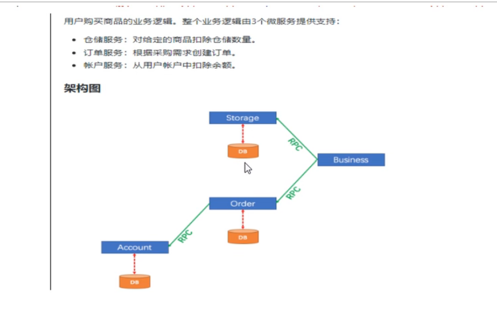

## Day14复习
sentinel+nacos的基本搭建
单位
- QPS
- 线程
影响范围
  - 直接
    - 关联
    - 链路
    
方法
直接失败
warmup
排队
持久化 
客户端保护 Feign(接口实现类) ribbon(在restTemplete调用的Controller上面添加@SentinelResource注解 并且使用 fallback和 blockHandler属性)

## Seata
seata 可以处理 服务器集群的数据库不一致问题 分布式服务
seata的配置比较麻烦 但是编码的难度较低
seata 选用版本为1.3.0 因为该版本支持mysql8
 - 配置的步骤 
   1 备份一个file.conf文件
    2 主要修改 自定义事务组名称+ 事务日志存储模式为db + 数据库链接信息
       - 修改store模块的mode从file改为db模式
       - 修改db模块的数据库信息
       - 将文件db_store.sql的内容添加到seata数据库中 
       - 将文件registry.conf的内容从file改为nacos 并且写上路径
       - 启动后 端口为8091

## seata的测试环境搭建
  - 实现一个 N对N的环境 (多个服务对应多个库)
 -  一个商品的流程 下订单 -> 检查库存 --> 检查用户的余额 -> 交易模块进行扣钱处理
    1 库存模块 - 库存库
    2 交易模块 
    3 订单模块 - 订单库 
    4 用户模块 - 用户库
    
   当用户下单 会在订单服务中创建一个订单 然后通过远程调用库存服务来扣减下单商品的库存
   再通过远程调用账户服务来扣减用户账户的余额
   最后再订单服务中修改订单的状态为完成
也就是要么一起成功 要么一起失败 也就是mysql的业务控制

## seata依赖
<!--        seata-->
        <dependency>
            <groupId>com.alibaba.cloud</groupId>
            <artifactId>spring-cloud-starter-alibaba-seata</artifactId>
            <exclusions>
                <exclusion>
                    <groupId>io.seata</groupId>
                    <artifactId>seata-all</artifactId>
                </exclusion>
            </exclusions>
        </dependency>
        <dependency>
            <groupId>io.seata</groupId>
            <artifactId>seata-all</artifactId>
          【这里的版本为你seata客户端的版本】
            <version>1.3.0</version>
        </dependency>

## seata_model流程
 0 搭建 gateway保护服务 端口为9357
 1 访问 :9357/Order下订单 并通过stream将消息发送进队列 
 2 库存模块 通过stream的sink.class 获取订单信息 并进入数据库查询库存 如果库存ok 就访问 :9357/value 查询对应的用户的余额是否大于 如果大于就扣钱 并且将库存减1 
   然后库存模块发送信息 给stream 订单模块收到对应的处理结果 进行对订单状态的处理 
    

## 明天的写

- 功能 : 支持通过订单号购买
- 解决完springcloud ok
- gateway

## springcloudAlibaba+SpringCLoud的总结
 消息注册 nacos zookeeper eureka Casoul 
 配置中心 nacos Bus+Config
 网关 gateway
 消息队列 Stream
 服务降级和服务熔断 Hystrix Sentinel
 服务消费 ribbon(通过@LoadBalance注解实现负载均衡算法) OpenFeign(自带负载均衡算法)
 分布式事务管理 Seata

 nacos的集群是通过nginx的负载均衡实现的 nginx的负载均衡是 upstream servername{ xx serverUrl}

    

